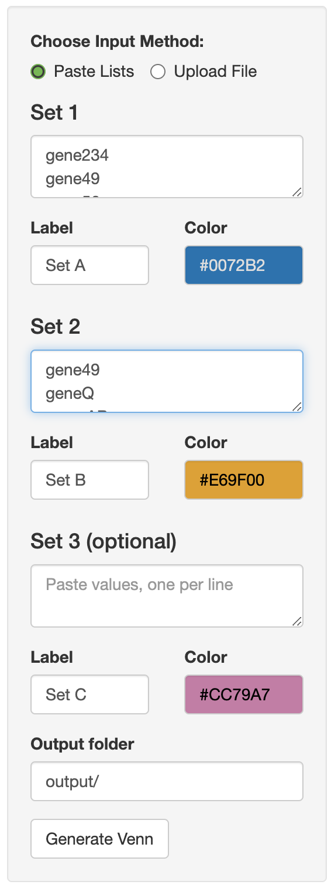
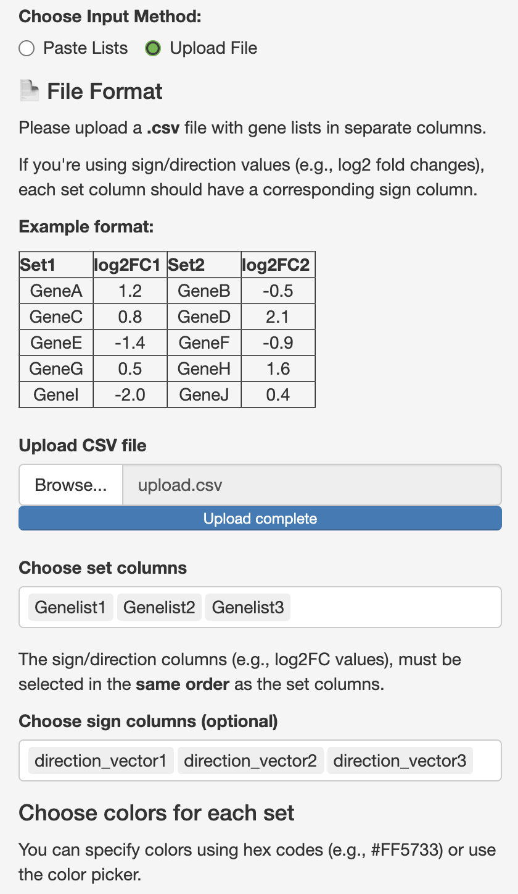
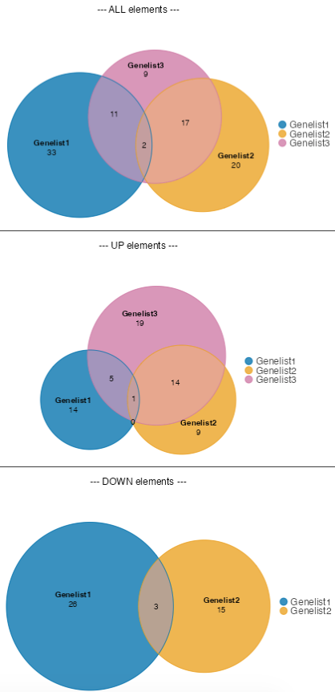

# Vennify

A minimal R Shiny app to generate proportional Venn diagrams from pasted or uploaded gene lists.

### Download or clone the repo

- Option 1: Download 
    - Click on the green 🟩 `< > Code ▼` 🟩 > `Download Zip`; unzip the folder to a desired location  
    - Click <span style="background-color:#2ea44f; color:white; padding:2px 6px; border-radius:4px;">Code ▼</span> > `Download Zip`; unzip the folder to a desired location  
    
- Option 2: Clone using Git
    - In the folder on Rstudio/terminal, run `git clone https://github.com/rskanchi/Vennify.git`

### Running the App

- Require R (\>= 4.1.0).  
- In R, `setwd(<project/folder>)` or in RStudio, open the project.  
- Install the R packages with `install.packages(c("shiny", "eulerr", "gplots", "stringi", "colourpicker"))` or 
restore the project environment if you're using `renv`.   

```r
install.packages("renv")
renv::restore()
```

- Run the app:  In R or Rstudio console, execute `shiny::runApp()` in the project folder. In RStudio, you can open `app.R` and 
click the `Run App` button in the upper right of the editor.   

### Input options

#### Paste lists

- Paste values (one per line) for up to 3 sets.  
- Customize each set's label and color.  
- Optionally, specify an output folder.  



#### Upload file

- Upload a `CSV` with set columns (set1, set2, ...) and optional sign columns (sign1, sign2, ...).  
- Sign columns could be the log2 fold change, correlation or any other numeric value indicating gene/feature directionality. 
- Select which columns to use as set and sign **in the same order** as set columns.  
- Choose custom colors for each set.  



### Output

The output files are saved in the folder path you specify.
- Proportional Venn diagrams (pdf format).  
- Unique/overlap set elements and frequencies (csv format).  
- If the sign variables are provided, the app will also generate UP and DOWN-regulated venns, lists and frequencies.  



### Notes

- You can edit the output folder by typing a valid path (local to the machine running the app).  
- `renv.lock` is included for reproducibility; the `renv/` folder is excluded to keep the repo light.   
- If you want to use renv, install it and uncomment this line in .Rprofile: `source("renv/activate.R")`.  

### License

This project is licensed under the MIT License.